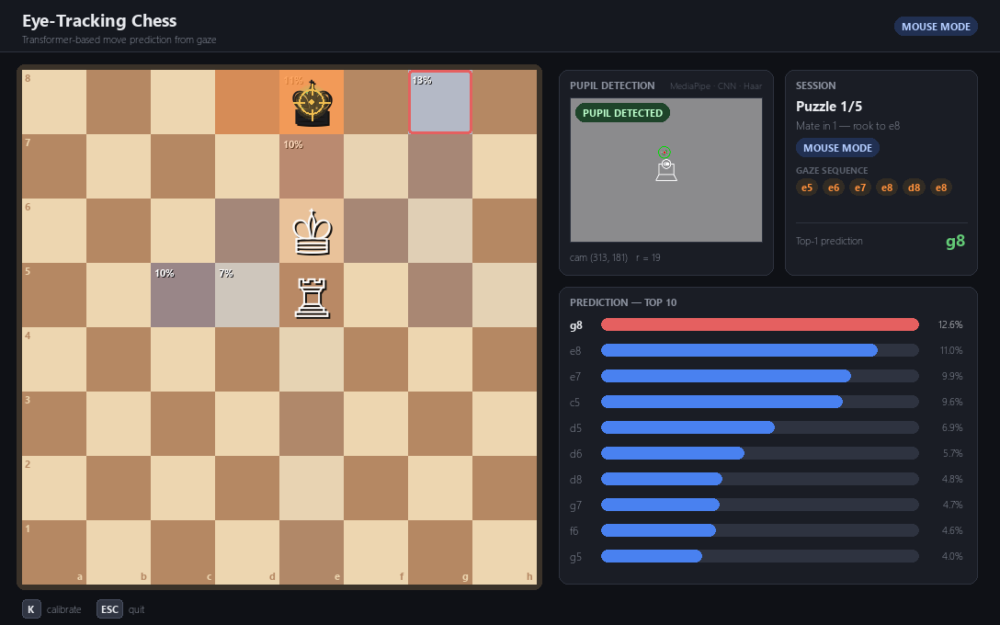
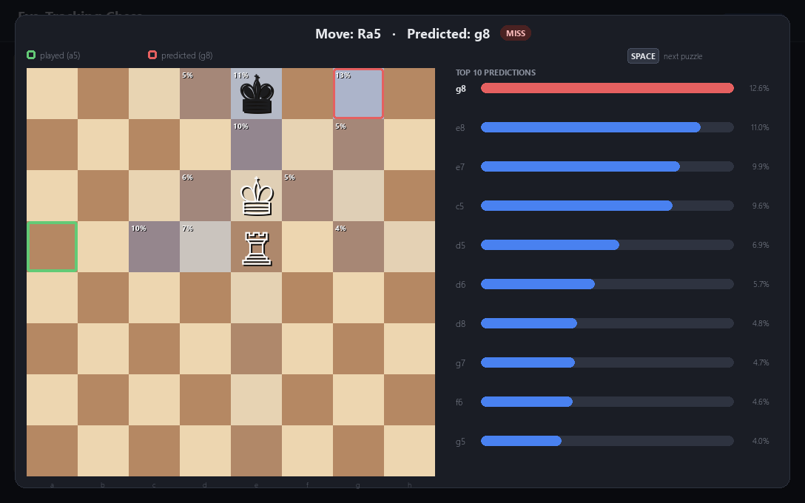

# Eye-Tracking Chess Transformer

Predicting a chess player's next move from where they look.

A webcam tracks the player's pupil, gaze is mapped onto the chessboard, and an
encoder–decoder Transformer turns the sequence of squares the player looked at
into a probability distribution over the destination square of their next move
— rendered live as a heatmap while they solve puzzles.

Built as a university course project for *Software Engineering of Large
Databases*.



## How it works

```
webcam frame
   │  MediaPipe Face Mesh iris landmarks  (fallback: GazeCNN / HoughCircles)
   ▼
pupil position (camera px)
   │  9-point polynomial calibration
   ▼
gaze position (screen px)  →  median + moving-average filter
   │  dwell-time fixation detection
   ▼
sequence of board squares, e.g.  e5 → e6 → e8 → d8
   │  tokenization: 64 squares + PAD + SOS
   ▼
encoder–decoder Transformer
   ▼
softmax over 64 squares  →  probability heatmap of the next move's target
```

Two neural networks are involved:

| Model | Task | Architecture |
|---|---|---|
| **GazeCNN** (`model.py`) | Pupil localization `(x, y, r)` in an eye image | 3 conv blocks → global average pooling → FC, ~100 K params |
| **Gaze Transformer** (`transformer_model.py`) | Next-square prediction from a gaze sequence | Encoder–decoder, d_model 64, 2 blocks, 4 heads, vocab 66 |

Since a webcam eye tracker is noisy, the demo also has a **mouse mode** where
the cursor acts as a gaze proxy — the same mode used to collect training data.

## Results

Trained on ~2 000 recorded moves from 44 games/puzzle sessions
(`data/gaze_dataset.csv` contains a small sample):

| Metric | Value |
|---|---|
| Transformer — validation Top-1 accuracy | **30.4 %** (random baseline: 1.6 %) |
| Transformer — validation Top-3 accuracy | **43.5 %** |
| GazeCNN — validation pupil error | ~14 px on a 256 × 256 eye image |

Training curves and pupil-detection examples: `checkpoints/training_curves_real.png`,
`checkpoints/predictions_viz.png`.

After every move the demo shows what the model believed before the move was
played:



## Project structure

| Path | Purpose |
|---|---|
| `realtime_demo.py` | Live demo — puzzles + prediction heatmap (eye tracker or mouse) |
| `collectdata.py` | Training-data collector — play vs. bot or solve puzzles while gaze is logged |
| `ui_theme.py` | Shared UI theme for both pygame apps |
| `transformer_model.py` | Encoder–decoder Transformer (from scratch, PyTorch) |
| `transformer_dataset.py` | Gaze-sequence tokenization + dataloaders |
| `transformer_train.py` | Transformer training (Top-k accuracy, ADE/FDE metrics) |
| `model.py` / `dataset.py` / `train.py` | GazeCNN pupil-detection model, dataset and training |
| `utils.py` | Screen→square mapping, fixation extraction, visualizations |
| `checkpoints/` | Pretrained weights — the demo works out of the box |
| `data/` | Sample gaze dataset + labeled eye images |

## Setup

```bash
pip install -r requirements.txt
```

Python 3.10+ recommended. All pretrained weights are included.

## Usage

**Run the demo** (pretrained models, no camera required):

```bash
python realtime_demo.py
```

Choose `M` for mouse mode, or `N` to calibrate the eye tracker (9 points).
Click a piece and a destination square to move; after each move an overlay
compares your move with the model's prediction. `SPACE` = next puzzle,
`K` = recalibrate, `ESC` = quit.

**Collect your own data:**

```bash
python collectdata.py
```

Play against the bot or solve puzzles; every move appends a
`(gaze_sequence, move)` record to `data/gaze_dataset.csv`. Optional:

- Put the [lichess puzzle database](https://database.lichess.org/#puzzles)
  at `data/lichess_puzzles.csv` for a larger puzzle pool (otherwise a daily
  puzzle + built-in fallbacks are used).
- Set the `STOCKFISH_PATH` environment variable to a Stockfish executable to
  play against an engine instead of a random-move bot.

**Retrain the Transformer** on the collected data:

```bash
python transformer_train.py
```

**Retrain the pupil CNN** (needs labeled eye images, see `data/annotation.csv`):

```bash
python train.py
```

## License

[MIT](LICENSE)
